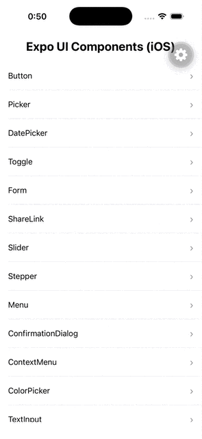

# Expo UI Example

<p>
  
  &nbsp;&nbsp;&nbsp;
  
</p>

[@expo/ui](https://github.com/expo/expo/tree/main/packages/expo-ui) のコンポーネント一覧を動作確認できるサンプルアプリです。

[expo/native-component-list](https://github.com/expo/expo/tree/main/apps/native-component-list/src/screens/UI) から UI スクリーンを抽出して、一覧形式で閲覧できるようにしています。

## 注意事項

`@expo/ui` はまだ実験的なパッケージであり、安定版ではありません。一部のコンポーネントで不具合が発生する可能性があります。

## セットアップ

### 必要な環境

- Node.js 18+
- iOS: Xcode (macOS のみ)
- Android: Android Studio

### インストール

```bash
# 依存関係をインストール
bun install

# prebuild (ネイティブコードを生成)
bun prebuild

# iOS シミュレータで実行
bun ios

# Android エミュレータで実行
bun android
```

> `@expo/ui` はネイティブコードを含むため、Expo Go では動作しません。`expo run:ios` または `expo run:android` で development build を使用してください。

## 収録コンポーネント

### iOS

| カテゴリ | コンポーネント                                                                                        |
| -------- | ----------------------------------------------------------------------------------------------------- |
| Input    | Button, ColorPicker, DatePicker, Picker, Slider, Stepper, TextInput, Toggle                           |
| Display  | Chart, Gauge, Image, Link, ProgressView, Shapes, Text                                                 |
| Layout   | Form, Grid, List, ScrollView, Section                                                                 |
| Overlay  | AlertDialog, BottomSheet, ConfirmationDialog, ContextMenu, Menu, Popover                              |
| Effect   | AnimationModifier, ContentTransition, GlassEffect, MatchedGeometryEffect, Modifiers, Rotation3DEffect |
| その他   | Carousel, HostingRNViews, RTL, ShareLink                                                              |

### Android

| カテゴリ | コンポーネント                                                                                                                    |
| -------- | --------------------------------------------------------------------------------------------------------------------------------- |
| Input    | Button, Checkbox, ColorPicker, DateTimePicker, IconButton, RadioButton, SegmentedControl, Slider, Switch, TextInput, ToggleButton |
| Display  | Card, Chip, Gauge, Progress, Shape                                                                                                |
| Layout   | Form, List                                                                                                                        |
| Overlay  | AlertDialog, BasicAlertDialog, BottomSheet, DropdownMenu                                                                          |
| Effect   | AnimatedVisibility, GraphicsLayer, Modifiers                                                                                      |
| その他   | Carousel, FloatingActionButton, HorizontalFloatingToolbar, HostingRNViews, JetpackComposePrimitives                               |

## 技術スタック

- Expo SDK 55
- React Native 0.83
- @expo/ui ~55.0.5
- Expo Router

## 参考リンク

- [Expo UI GitHub](https://github.com/expo/expo/tree/main/packages/expo-ui)
- [Native Component List (元ソース)](https://github.com/expo/expo/tree/main/apps/native-component-list/src/screens/UI)
